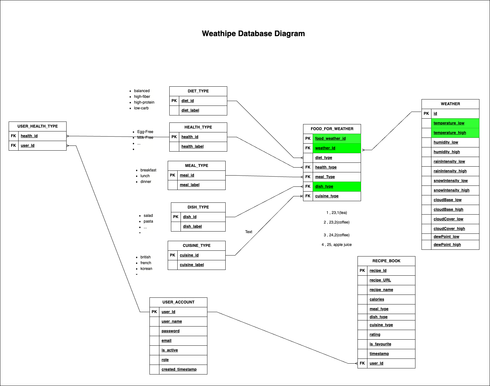
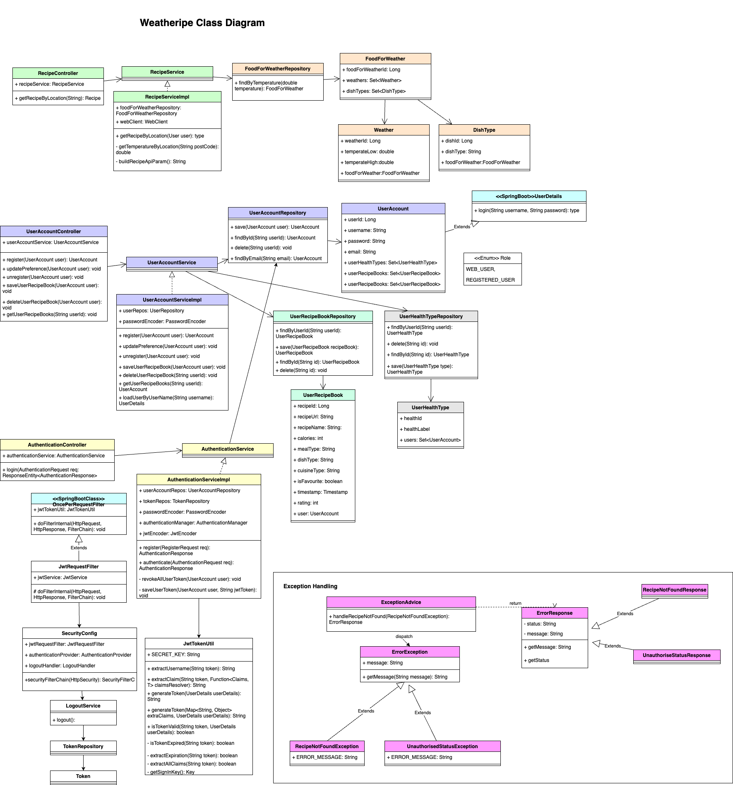
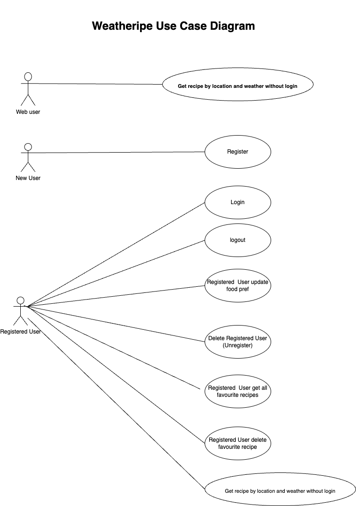

# Weatheripe API 
## Introduction
Sometimes we may have difficulties to decide what to cook for the meal. 
So we introduced Weatheripe which provide a list of Rest APIs for users to query the recipes based on the weather at their locations.
User can simply input the location. Then Weatheripe will base on the location to check the weather and returns suitable recipes. 
eg. If it is hot, Weatheripe would recommend recipes which can cool you down. If it is cold, Weatheripe would recommend recipes to warm you up.

## Technology
Java 17, Spring Boot 3.0.2

## UML Diagram
1. DB Schema



2. Class Diagram



## Key Features

Weatheripe utilize the tomorrow.io APIs to get the weather of the specified location, eg. London and then based on internal data processing to decide which food type are suitable for the weather and pass it to Edamam API to get the recipe result to recommend to our user. 

### Public functions:
1. Recommend recipe by the temperature of the location input
2. View the Dish Type from our DB

### Registered User functions:
User managements:
1. User can register for an user accounts
2. User can also unregistered their user accounts when they don't need the functions

Registered user can enjoy the below features: 
1. User can save the favourite recipe into their user account
2. User can retrieve the recipe lists that saved
3. User can update the rating of the favourite recipes
4. User can remove the recipes from its favourite recipes list

### Use case diagram



## How to run unit test
```
mvn clean test
```

## How to run the program
```
mvn compile exec:java -Dexec.mainClass="com.techreturners.weatheripe.WeathipeApplication"
```
API documentation can be found in [Swagger](http://localhost:8080/swagger-ui/index.html) after local server start up.

## Assumptions:

## Approaches:

This Java Spring Boot API project uses the following approaches:

### Architecture
The project follows the Model-View-Controller (MVC) architecture pattern, which separates the application into three interconnected components: the model, the view, and the controller. This allows for a clean separation of concerns and makes the codebase easier to manage.

### Frameworks and Libraries
The project uses the following frameworks and libraries:

- springframework.boot:3.0.2: A popular framework for building enterprise-level Java applications.
- Hibernate: A powerful ORM tool for working with databases.
- JPA: A Java Persistence API that provides a standard way to work with relational databases.
- io.jsonwebtoken 0.11.5: A library for JSON Web Tokens (JWTs), which are used for secure authentication and authorization.
- webflux: A reactive web framework for building non-blocking, event-driven applications.
- com.c4-soft.springaddons 6.1.3: A library that provides additional features and utilities for Spring Boot applications.

### Database
The project uses Postgres as the deployment database and H2DB for testing and development purposes.

### Testing
The project uses the following testing frameworks and libraries:

- Mockito: A mocking framework for Java that allows for easy testing of dependencies.
- JUnit: A popular unit testing framework for Java that provides a simple and efficient way to test code.

### Security
The project uses Spring Security with JWT tokens and user role-based access control to secure the endpoints. This provides a robust and secure way to authenticate and authorize users of the API.

### Deployment

### Documentation


## Future thoughts:
Below are the functions to be implemented:
1. Allow user saving dietary preferences and use it to search recipes, so that system can base on the dietary preference to recommended suitable recipes to users.
2. Allow user to subscribe, so user can receive our recommend recipe by time by day with a sms
3. Food diary
4. Recommend recipe by location, based on the location, Weatheripe to recommend user the recipe that belongs to their location, so that user can buy ingredients easily. eg. If you are in UK, Weatheripe will recommend British food, to ensure that most ingredients you can buy are easily available in local supermarket and eliminate the headache to find the ingredients.
5. Deployment to AWS cloud
6. Add front end user interface
7. Add CI/CD pipeline

## Reference:

1. https://www.tomorrow.io/
2. https://www.edamam.com/


