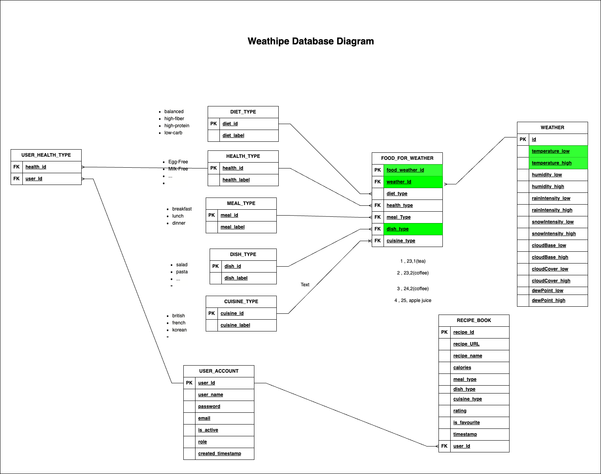

# Weatheripe API 
## Introduction
Weatheripe provide a list of Rest API for users to query the recipe based on the weather at their locations.

## Technology
Java 17, Spring Boot 3.0.2

## UML Diagram
1. DB Schema



2. Class Diagram


## Key Features

### Public functions:
1. Recommend recipe by the temperature of the location input
2. View the Dish Type from our DB

### Registered User functions:
User managements:
1. User can register for an user accounts
2. User can also unregistered their user accounts when they don't need the functions

Registered user can enjoy the below features: 
1. User can save the favourite recipe into their user account
2. User can retrieve the recipe lists that saved
3. User can update the rating of the favourite recipes
4. User can remove the recipes from its favourite recipes list

### Use case diagram


## How to run unit test
```
mvn clean test
```

## How to run the program
```
mvn compile exec:java -Dexec.mainClass="com.techreturners.weatheripe.WeathipeApplication"
```

## Assumptions:

## Approaches:

## Future thoughts:
